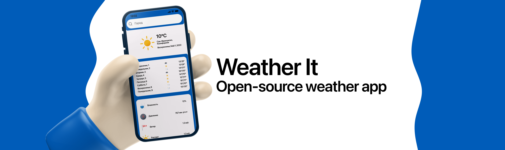

# Weather It

## Об приложении
Погодное приложение с открытым исходным кодом, созданное с помощью библиотеки [Jetpack Compose](https://developer.android.com/jetpack/compose), В рамках школьного индивидуального проекта.  
Использованные технологии:
- Jetpack Compose
- MVVM архитектура
- LiveData, Flow
- Koin DI
- Kotlinx Datetime

## Дорожная карта
- [ ] Переход на clean architecture
- [ ] Unit, UI тестирование
- [ ] Доработать DataStore
- [ ] Доработать UI
- [ ] Оптимизировать приложение
- [ ] Геолокация

## Установка
(Android)
1. Загрузите последний релиз из [Releases](https://github.com/LeFFaQ/Weather-It/releases)
2. Установите

